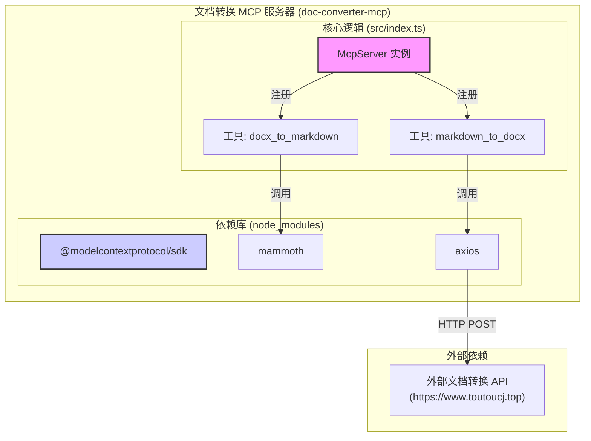

# 项目架构文档：文档格式转换 MCP 服务器

## 1. 系统概述

本文档详细描述了 "文档格式转换 MCP 服务器" 的软件架构和设计决策。该服务器是一个基于 Node.js 的独立应用程序，它实现了模型-上下文协议（MCP），为大语言模型（LLM）提供了一套文档处理工具。

## 2. 技术栈

-   **运行时环境**: Node.js (>=16.0.0)
-   **编程语言**: TypeScript
-   **核心框架**: `@modelcontextprotocol/sdk` - 用于快速构建 MCP 服务器。
-   **主要依赖库**:
    -   `mammoth`: 用于在本地将 `.docx` 文件转换为纯文本。
    -   `axios`: 用于向外部 API 发送 HTTP 请求。
    -   `zod`: 用于定义和验证工具的输入参数模式，确保类型安全。
-   **构建工具**: `tsc` (TypeScript Compiler)

## 3. 架构风格

系统采用**组件化**和**事件驱动**的架构风格。

-   **组件化**: 每个核心功能（如 `docx_to_markdown` 和 `markdown_to_docx`）被封装为独立的 MCP 工具。这种设计使得功能模块化，易于单独测试、维护和扩展。
-   **事件驱动**: 作为 MCP 服务器，系统通过标准输入/输出（stdio）被动地监听来自 MCP 客户端的 JSON-RPC 请求。它根据请求中的方法名（即工具名）来触发相应的处理逻辑。

## 4. 系统组件



-   **McpServer 实例**: 整个应用的核心，负责处理与客户端的通信、工具的注册和生命周期管理。
-   **`docx_to_markdown` 工具**: 一个本地处理器，使用 `mammoth` 库实现文件转换。
-   **`markdown_to_docx` 工具**: 一个 API 客户端，封装了对外部转换服务的调用逻辑，包括文件读取、Base64 编码和 HTTP 请求的构造。

## 5. 目录结构

```
doc-converter-mcp/
├── build/                  # 编译后的 JavaScript 输出目录
│   └── index.js
├── node_modules/           # 项目依赖
├── src/                    # TypeScript 源代码
│   └── index.ts            # 服务器主入口，包含所有工具的定义和实现
├── package.json            # 项目元数据和依赖管理
├── package-lock.json       # 精确的版本锁定
└── tsconfig.json           # TypeScript 编译器配置
```

## 6. 数据流

### 6.1. `docx_to_markdown` 流程

1.  **客户端** → **服务器**: 发送包含 `tool_name: "docx_to_markdown"` 和 `params: { path: "..." }` 的 JSON-RPC 请求。
2.  **服务器**: `McpServer` 实例接收请求，调用 `docx_to_markdown` 工具的处理器。
3.  **工具**: 使用 `mammoth.extractRawText()` 读取并转换指定路径的 `.docx` 文件。
4.  **服务器** → **客户端**: 返回包含转换后 Markdown 字符串的 JSON-RPC 响应。

### 6.2. `markdown_to_docx` 流程

1.  **客户端** → **服务器**: 发送包含 `tool_name: "markdown_to_docx"` 和相应参数的请求。
2.  **服务器**: `McpServer` 实例调用 `markdown_to_docx` 工具的处理器。
3.  **工具**: 从环境变量 `process.env.DOC_CONVERTER_API_KEY` 读取 API 密钥。
4.  **工具**: 读取 `referencePath` 的文件，并进行 Base64 编码。
5.  **工具**: 使用 `axios` 将 Markdown 内容、编码后的参考文件和 API 密钥发送到外部 API。
6.  **外部 API**: 返回生成的 `.docx` 文件的二进制数据。
7.  **工具**: 将二进制数据写入 `outputPath`。
8.  **服务器** → **客户端**: 返回包含成功消息和输出路径的 JSON-RPC 响应。

## 7. 部署与配置

-   **编译**: 在部署前，必须在项目根目录下运行 `npm run build` 来编译 TypeScript 代码。
-   **启动**: 服务器通过 `node build/index.js` 命令启动。
-   **配置**:
    -   必须通过 MCP 客户端的配置来启动服务器进程。
    -   必须在 MCP 客户端的 `env` 配置中设置 `DOC_CONVERTER_API_KEY` 环境变量，以供 `markdown_to_docx` 工具使用。
